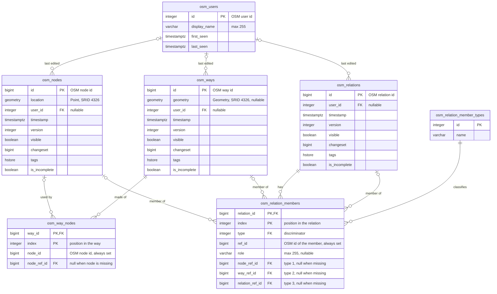

# OsmPlayground.Data

EF Core data model for OpenStreetMap (OSM) data, stored in PostgreSQL with
PostGIS and hstore.

The tables mirror the OSM data model closely: they hold what an import of an
OSM extract contains, with little transformation beyond building geometries for
nodes and ways.

## Entity relationship diagram



## Tables

| Table | Entity | Contents |
|---|---|---|
| `osm_users` | `OsmUser` | Users who last edited an element. |
| `osm_nodes` | `OsmNode` | Points, with their location. |
| `osm_ways` | `OsmWay` | Ordered lists of nodes, with a geometry built from them. |
| `osm_way_nodes` | `OsmWayNode` | The nodes of each way, in order. |
| `osm_relations` | `OsmRelation` | Groups of nodes, ways and other relations. |
| `osm_relation_members` | `OsmRelationNodeRef`, `OsmRelationWayRef`, `OsmRelationRelationRef` | The members of each relation, in order, with their role. |
| `osm_relation_member_types` | `OsmRelationMemberTypeLookup` | Lookup for the member `type` column: 1 Node, 2 Way, 3 Relation. Seeded by the migration. |

Nodes, ways and relations share the columns of `OsmEntity`: `user_id`,
`timestamp`, `version`, `visible`, `changeset`, `tags` and `is_incomplete`.
Each has its own table; there is no shared base table.

## Design notes

### Identifiers

Primary keys are the ids from OSM, so no key is generated by the database. Node,
way and relation ids are `bigint`; user ids are `integer`.

`user_id` is nullable because many extracts, including Geofabrik's public ones,
strip user details, and some older data is anonymous.

### Incomplete data

An extract rarely contains everything its ways and relations refer to. For
example, a boundary relation crossing the edge of the extract has members that
are not in the file. The model keeps the reference without requiring the
referenced element:

- The OSM id is always stored: `osm_way_nodes.node_id` and
  `osm_relation_members.ref_id`.
- A separate nullable column carries the foreign key: `node_ref_id`,
  `way_ref_id` or `relation_ref_id`. It equals the OSM id when the element is
  in the database, and is null when it is missing.
- Check constraints stop the two disagreeing:
  - `ck_osm_way_nodes_node_ref_matches_node_id`: `node_ref_id` is null or equals
    `node_id`.
  - `ck_osm_relation_members_ref_matches_type`: for each member, only the column
    for its `type` may be set, and it must be null or equal `ref_id`.
- `is_incomplete` marks a node, way or relation that refers to missing data. The
  importer sets it; `OsmWay.CreateGeometryFromAssociatedNodes()` also sets it
  for ways.

The importer must set the `*_ref_id` properties itself when the referenced
element exists. They are not derived from the OSM id.

### Geometry

All geometries use SRID 4326 (WGS 84 longitude/latitude) and have a GiST index.

- `osm_nodes.location` is a `Point`. `OsmNode.Latitude` and `Longitude` are read
  from it and are not stored separately.
- `osm_ways.geometry` is built by `OsmWay.CreateGeometryFromAssociatedNodes()`:
  - a `Polygon` when the way is closed (first node equals last) and has at least
    four nodes;
  - a `LineString` when it has two or more nodes otherwise;
  - a `Point` when it has a single node;
  - null when any node is missing, as a partial shape would misrepresent the way.

A closed way is not always an area in OSM (a roundabout is closed but is a
line); the tags decide that, and the geometry does not yet take them into
account.

### Tags

Tags are stored as `hstore` with a GIN index, which supports the `@>`, `?`,
`?|` and `?&` operators. For example:

```sql
SELECT id FROM osm_ways WHERE tags @> 'highway=>primary';
```

### Ordering

Way nodes and relation members are ordered, so both tables are keyed on
`(parent id, index)`. The same node or member can appear more than once; a
closed way repeats its first node at the end.

### Delete behaviour

| Foreign key | On delete | Effect |
|---|---|---|
| `osm_relation_members.relation_id` | CASCADE | Deleting a relation deletes its member list, not the members. |
| `osm_relation_members.node_ref_id`, `way_ref_id`, `relation_ref_id` | RESTRICT | An element can't be deleted while a relation uses it. Remove it from the relation first. |
| `osm_way_nodes.node_ref_id` | RESTRICT | A node can't be deleted while a way uses it. |
| `osm_way_nodes.way_id` | RESTRICT | A way can't be deleted until its way nodes are deleted. |
| `*.user_id` | RESTRICT | A user can't be deleted while they have edits. |
| `osm_relation_members.type` | RESTRICT | Lookup rows can't be deleted while in use. |

OSM permits cycles of relations (1 contains 2, which contains 3, which contains
1). To delete a cycle, break it by removing one of the members first, or delete
the member rows of every relation in the cycle before deleting the relations.
A single `DELETE` of all the relations in a cycle fails, because PostgreSQL
checks the restricting foreign keys before the cascade removes the member rows.

### Relation members

`OsmRelationMember` is mapped with table-per-hierarchy: all member types share
`osm_relation_members`, and `type` is the discriminator. The type-specific
foreign key columns exist so each can reference the right table; a single
column can't hold a foreign key to three tables.

### Naming

Columns, keys, constraints and indexes use snake_case through
`UseSnakeCaseNamingConvention()` in `OsmDbContext.OnConfiguring`. Table names
are set explicitly with `ToTable`. The check constraint SQL uses the snake_case
column names directly, so renaming a property means updating that SQL too.

## Migrations

See the Database section of the repository's `CLAUDE.md` for the commands to
add and apply migrations.
